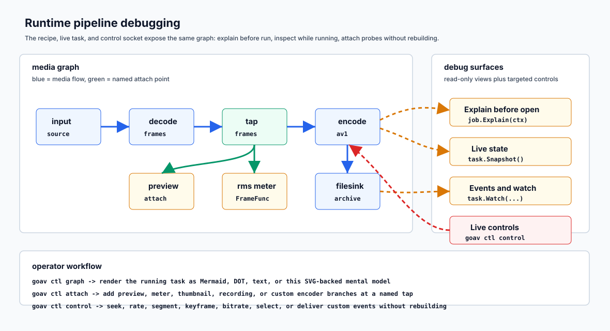

# goav

`goav` is a pure-Go media runtime for applications that need to describe,
validate, run, inspect, and change media work in-process.

You write one recipe: inputs, selected streams, operations, taps, branches, and
destinations. The recipe is validated before resources open, then compiled into
a task that can report its plan, expose snapshots and events, accept runtime
branches, and receive live controls.

No cgo is required for the core runtime, and no FFmpeg or GStreamer process is
started behind your back. `CGO_ENABLED=0` builds a static binary when your
selected adapters allow it.

```sh
go get github.com/thesyncim/goav
```

```go
return goav.From(input).
    Video().
    Decode().
    Resize(1280, 720).
    Encode(codec.VP9(codec.Bitrate(2_000_000))).
    To(goav.File("preview.ivf", preview)).
    Run(ctx)
```

The grammar stays small:

- `Input`: file, URI, transport provider, generated source, or application
  source.
- `Stream`: `.Audio()`, `.Video()`, or an explicit stream selector.
- `Tap`: a named attach point, optionally typed with `goav.FrameTap(...)` or
  `goav.PacketTap(...)`.
- `Branch`: one downstream operation sequence from a stream point or tap.
- `Destination`: file, URI, writer, custom provider, shared mux, or sink.
- `Flow`: reusable operations with no destination attached.
- `Task`: a running graph with control, events, snapshots, attach, rebranch,
  and detach.

The public grammar stays Input, Stream, Tap, Branch, Destination, Flow, and
Task. Operations are methods on a chain: `.Decode()`, `.Copy()`, `.Resize()`,
`.Resample()`, `.Do(stage)`, `.Encode(codec)`, and `.To(destination)`.

## 30-Second Examples

Packet-preserving RTP/WebRTC recording:

```go
return goav.From(goav.Input(rtpav.Receive(video, rtpav.WithName("video"), rtpav.WithCodec(codec.VP8())))).
    Copy().
    To(goav.File("recording.ivf", file)).
    Run(ctx)
```

Packet-preserving file fanout:

```go
return goav.From(goav.FileInput("input.ivf", in)).
    Copy().
    To(
        goav.File("archive.ivf", archive),
        goav.File("preview.ivf", preview),
    ).
    Run(ctx)
```

Decode one WebRTC audio track to frames:

```go
return goav.From(goav.Input(webrtcav.Track(track))).
    Audio().
    Decode().
    To(goav.Sink(frames)).
    Run(ctx)
```

Run a generated video source from the command line and write decoder-readable
AV1 IVF:

```sh
goav run 'testsrc video width=1280 height=720 fps=30 duration=3s realtime=true pattern=bars ! encode codec=av1 media=video bitrate=1200k fps=30 keyframe_interval=60 min_qindex=20 max_qindex=180 tune=zerolatency ! filesink location=/tmp/goav-av1.ivf'
```

`goav.Default()` bundles the standard adapters: IVF, Annex B, Matroska, and WebM
containers; Opus, VP8, VP9, AV1, and H264 codec adapters; resize and resample
filters. Other containers, transports, codecs, and stores plug in through
per-runtime registration.

For the project roadmap, see [docs/ROADMAP.md](docs/ROADMAP.md). For the
GStreamer comparison, see
[docs/GSTREAMER_ALTERNATIVE.md](docs/GSTREAMER_ALTERNATIVE.md).

## Composition Patterns

### Branches and destinations

Use branches when one media point must feed several downstream operation
sequences. Reuse the same destination value when those branches should share
one mux, one sink group, or one transactional writer.

```go
out := goav.File("web.webm", webFile)

return goav.From(goav.FileInput("source.webm", in)).
    Video().
    Decode().
    Branches(
        goav.Branch("v720").
            Resize(1280, 720).
            Encode(codec.VP9(codec.Bitrate(2_000_000))).
            To(out),
    ).
    Audio().
    Decode().
    Branches(
        goav.Branch("a96").
            Resample(48_000, codec.Stereo).
            Encode(codec.Opus(codec.Bitrate(96_000))).
            To(out),
    ).
    Run(ctx)
```

Distinct destination values keep branches independent. Reuse the same
destination value when several branches should produce one container or one
shared sink.

### Shape validation

Recipes are checked before work starts. Encoders consume frames, `Copy()`
consumes packets, resize and resample consume decoded media, and byte
destinations consume packet-domain media. A violation fails `Explain`, `Build`,
`Attach`, and `Rebranch` with a structured `BuildError`: code, operation, node,
machine-readable details, and concrete fixes. See
[docs/ERRORS.md](docs/ERRORS.md).

Format mismatches that a conversion can solve are explicit. `.Auto(...)` grants
the planner permission to insert a conversion; `.Require(...)` asserts the
shape contract at a chosen point.

```go
return goav.From(mic).
    Audio().
    Auto(shape.AllowResample()).
    Require(shape.Frame(av.MediaAudio, shape.Audio(48_000, 2, ""))).
    Encode(codec.Opus(codec.Bitrate(96_000))).
    To(goav.File("voice.webm", out)).
    Run(ctx)
```

Without `shape.AllowResample()`, the same chain refuses the build and names the
policy to add. `.Prefer(...)` is soft: it biases open choices, never makes a
build fail, and reports whether the preference was applied or ignored.

### Typed taps

Taps name stable points for diagnostics and runtime attachment. Use
`goav.FrameTap(...)` or `goav.PacketTap(...)` when the domain matters.

```go
decoded := goav.FrameTap("video.decoded")
frames720p := goav.FrameTap("video.720p.frames")

thumbnail := goav.Sink(goav.SinkFunc("thumbnail", saveFrame))
web := goav.File("web.ivf", webFile)

return goav.From(input).
    Video().
    Decode().
    Tap(decoded).
    Resize(1280, 720).
    Tap(frames720p).
    Branches(
        goav.Branch("thumbnail").
            From(decoded).
            Resize(320, 180).
            To(thumbnail),
        goav.Branch("web").
            From(frames720p).
            Encode(codec.VP9(codec.Bitrate(2_000_000))).
            To(web),
    ).
    Run(ctx)
```

### Branch buffers

Branch buffers are branch-local. Blocking buffers preserve every message;
dropping buffers are for realtime previews, meters, and diagnostics.

```go
return goav.From(input).
    Video().
    Decode().
    Branches(
        goav.Branch("archive").
            Buffer(flow.Blocking(128)).
            Encode(codec.VP9(codec.Bitrate(4_000_000))).
            To(archive),
        goav.Branch("preview").
            Buffer(flow.DropOldest(3)).
            Resize(640, 360).
            To(preview),
        goav.Branch("latest").
            Buffer(flow.Latest()).
            To(goav.Sink(goav.SinkFunc("latest", inspect))),
    ).
    Run(ctx)
```

Buffered branches own queued media according to their copy policy. The default
copies mutable payloads before they enter a branch-owned queue, so one branch
cannot corrupt a sibling.

### Flows

A flow is reusable operations. A branch owns the destination.

```go
voice := goav.Flow("voice").Audio().
    Resample(16_000, codec.Mono).
    Encode(codec.Opus(codec.Bitrate(32_000), codec.Channels(codec.Mono)))

archive := goav.Flow("archive").Audio().
    Resample(48_000, codec.Stereo).
    Encode(codec.Opus(codec.Bitrate(128_000), codec.Channels(codec.Stereo)))

voiceOut := goav.File("voice.ogg", voiceFile)
archiveOut := goav.File("archive.ogg", archiveFile)

return goav.From(goav.Input(webrtcav.Track(audio))).
    Audio().
    Decode().
    Branches(
        goav.Branch("voice").Apply(voice).To(voiceOut),
        goav.Branch("archive").Apply(archive).To(archiveOut),
    ).
    Run(ctx)
```

Use a direct stream when one reusable flow feeds one destination. Use branches
when the same media point needs several downstream operation sequences. Flows
also apply to runtime branches attached from taps.

## Runtime Tasks

Build a task when the application needs inspection, events, late attachment, or
live control.

```go
frames720p := goav.FrameTap("video.720p.frames")
web := goav.File("web.ivf", webFile)

task, err := goav.From(input).
    Video().
    Decode().
    Branches(
        goav.Branch("720p").
            Resize(1280, 720).
            Tap(frames720p).
            Encode(codec.VP9(codec.Bitrate(2_000_000))).
            To(web),
    ).
    Build(ctx)
go func() { _ = task.Run(ctx) }()

shots, err := task.Attach(ctx,
    goav.Branch("screenshots").
        From(frames720p).
        Resize(320, 180).
        To(goav.Sink(goav.SinkFunc("screenshots", collectScreenshot))),
)
// Later:
return task.Detach(ctx, shots)
```

One `task.Attach(ctx, ...)` call adds several runtime branches atomically.
Branches in the same attach call may share one destination value, and later
branches may use taps published by earlier branches. If any branch fails, the
whole attach rolls back.

`Attachment.Rebranch` replaces a branch without a delivery gap: the replacement
starts receiving before the old branch is detached. Switch policies gate the
handover to a clean stream boundary.

```go
rec, err := task.Attach(ctx,
    goav.Branch("rec").From(frames720p).Encode(codec.VP9()).To(goav.File("part-001.ivf", first)),
)

rec2, err := rec.Rebranch(ctx,
    goav.Branch("rec").From(frames720p).Encode(codec.VP9()).To(goav.File("part-002.ivf", second)),
    goav.SwitchAt(goav.NextKeyframe()),
    goav.DrainOldBranch(),
)
```

Sources can discover streams after startup. `OnStream` declares what to attach
when a matching stream appears; failures surface as events and roll back like
manual attach.

```go
task, err := goav.From(input).
    OnStream(goav.MatchMedia(av.MediaAudio),
        goav.Branch("record").Copy().To(archive),
    ).
    Audio().Copy().To(live).
    Build(ctx)
```

Live controls use the same task API, whether they are called from Go or through
the control socket:

```go
err := task.Control(ctx, goav.Keyframe("video"))
err = task.Control(ctx, goav.SetBitrate("video", 900_000))
err = task.Control(ctx, goav.SelectActive("cam2"))
err = task.Control(ctx, goav.Seek(30*time.Second))
err = task.Control(ctx, goav.Rate(2.0))
err = task.Control(ctx, goav.Segment(10*time.Second, 20*time.Second))
```

`goav.Keyframe`, `goav.SetBitrate`, and `goav.SelectActive` ride the media path
to relevant nodes. `goav.Seek`, `goav.Rate`, and `goav.Segment` reach
controllable sources directly. `.AtTap(name)` narrows a control to a named tap,
and `goav.Deliver(event)` sends a verbatim event to a stage that understands it.

## Debug And Diagnostics

Debugging is regular composition. Put a typed tap where you want visibility,
call `job.Explain(ctx)` before opening resources, attach a diagnostic branch at
runtime, then inspect task state and events.



```go
decoded := goav.FrameTap("audio.decoded")

job := goav.From(goav.Input(webrtcav.Track(audio))).
    Audio().
    Decode().
    Tap(decoded).
    To(goav.Sink(playback))

report, err := job.Explain(ctx)
for _, warning := range report.Warnings {
    log.Printf("goav plan warning code=%s node=%s msg=%s",
        warning.Code, warning.Node, warning.Message)
}

task, err := job.Build(ctx)
defer task.Close()
go func() { _ = task.Run(ctx) }()

levels, err := task.Attach(ctx,
    goav.Branch("levels").
        From(decoded).
        Do(goav.FrameFunc("rms", func(_ context.Context, frame *goav.Frame, emit goav.Emit) error {
            observeRMS(frame)
            return emit.Frame(frame)
        })).
        To(goav.Sink(goav.SinkFunc("levels", func(context.Context, goav.Message) error { return nil }))),
)
defer levels.Close(ctx)

state := task.Snapshot()
branchState := levels.Snapshot()
_ = branchState
for _, branch := range state.Branches {
    log.Printf("branch=%s state=%s frames=%d", branch.Name, branch.State, branch.Stats.Frames)
}
```

Task.Snapshot() returns a point-in-time task view. `task.Snapshot()` is the
method you call in application code. Attachment.Snapshot() returns the
branch-owned view.

`task.Events()` is the single event stream. Prefer `task.Watch(...)` when
several consumers need independent filters:

```go
eos := task.Watch(goav.WatchTypes(av.EventEndOfStream))
loss := task.Watch(goav.WatchTypes(av.EventPacketLoss), goav.WatchStream("video"))
```

The graph renderer is outside core. Use `graphrender.RenderTaskFlowchart(task)`
for a running task, `graphrender.RenderSnapshotFlowchart(task.Snapshot())` for a
captured task view, and `graphrender.RenderBranchFlowchart(attachment.Snapshot())`
for one runtime branch.

## Testing Your Pipeline

`goavtest` provides deterministic sources, collectors, clocks, codecs, and
containers. The helpers return real recipe values, so test code uses the same
surface as production code.

```go
out := goavtest.NewCollector()
task, _ := goav.Mix(
    goav.From(goavtest.Audio(48000, 1, []int16{100}, []int16{200})).Audio(),
    goav.From(goavtest.Audio(48000, 1, []int16{50}, []int16{-50})).Audio(),
).To(out.Sink()).UseRuntime(goavtest.Runtime()).Build(ctx)
_ = task.Run(ctx)
// out.S16() == [[150] [150]]
```

`goavtest.Runtime()` includes standard filters, fake codecs for known codec
ids, fake containers for known formats, and a fake clock. Use
`goavtest.NewTestSource` when a test needs a provider-shaped fixture that can
record source controls and emit a script of packets, frames, and events.

```go
packet := &av.Packet{Payload: av.Buffer{Bytes: []byte{1}, Ownership: av.BufferImmutable}}
source := goavtest.NewTestSource("fixture",
    shape.Packet(av.MediaAudio, av.CodecOpus, shape.Audio(48_000, 1, av.SampleFormatS16)),
    goavtest.TestSourceLive(),
    goavtest.TestSourceScript(
        goavtest.TestSourcePacket(packet),
        goavtest.TestSourceEvent(av.Event{Type: av.EventStats, Reason: "ready"}),
    ),
)
task, _ := goav.From(source.Input()).Audio().Copy().
    To(goavtest.NewCollector().Sink()).
    UseRuntime(goavtest.Runtime()).Build(ctx)
_ = task.Control(ctx, goav.Rate(0.5).At("fixture"))
event, _ := source.WaitControl(ctx, av.EventRate)
```

Compiled examples double as bootstrap documentation:
`ExampleSource_pushAccounting` shows `goav.SourcePush` delivery accounting,
`ExampleWriter_transactionalUpload` shows a `goav.Writer` upload with
`provider.Info` and `provider.TransactionalWriter`,
`ExampleWithEncoder_customSettings` shows typed codec settings plus
`codec.Control` for native encoder options, `ExampleTask_flowchart` renders a
live task with an attached branch through
`graphrender.RenderTaskFlowchart(task)`, and `ExampleTestSourceScript` shows a
mixed frame/event source fixture.

## String Launcher And Control Socket

The bundled CLI can run a generated-source pipeline from one string. This is
useful for smoke tests, adapter bootstrap, and control-plane demos.

```sh
goav run 'testsrc video width=1280 height=720 fps=30 duration=3s realtime=true pattern=bars ! encode codec=av1 media=video bitrate=1200k fps=30 keyframe_interval=60 ! filesink location=/tmp/goav-av1.mkv format=matroska'
```

Generic `encode` reflects over `codec.CodecSettings`: every tagged setting is
available to the string launcher and control socket, and the generated
`goav ctl help attach` / `goav ctl capabilities` output is the reference. Keys
not claimed by a typed codec field are left in `CodecSettings.Custom` for the
adapter. Host-owned encoder spellings use the same reflected struct tags through
`ctl.NewEncoderSpec[T]`.

The same launcher can expose a control socket:

```sh
goav run --control unix:///tmp/goav-live.sock \
  'testsrc video name=fixture width=1280 height=720 fps=30 duration=30s realtime=true pattern=bars ! tap name=frames ! encode codec=av1 media=video bitrate=1200k fps=30 keyframe_interval=60 ! filesink location=/tmp/goav-av1.mkv format=matroska'

goav ctl --control unix:///tmp/goav-live.sock graph
goav ctl --control unix:///tmp/goav-live.sock control rate value=0.5 source=fixture
goav ctl --control unix:///tmp/goav-live.sock control seek position=2s source=fixture
goav ctl --control unix:///tmp/goav-live.sock attach frames as preview \
  'resize width=320 height=180 ! encode codec=av1 media=video bitrate=300k fps=2 keyframe_interval=1 ! filesink location=/tmp/goav-preview.mkv format=matroska'
goav ctl --control unix:///tmp/goav-live.sock stop
```

Application hosts use package `ctl` to expose the same socket. The socket can
serve built-in controls, explicit app-owned commands, custom branch-pipeline
steps, runtime-registered custom codec names, and optional custom encoder
spellings for native settings. `goav ctl capabilities`, `goav ctl help attach`,
and `goav ctl help rebranch` report the running host's allowlist.

The self-contained playground in
[examples/control-plane-host](examples/control-plane-host) starts a live
`goavtest.TestSource`, accepts `goav ctl control rate/seek/segment
source=fixture`, supports raw JSON control/event fallback, exposes
`goav ctl control fixture.controls`, attaches transcode and thumbnail branches,
uses generic custom runtime encoders, maps native custom encoder settings,
renders the graph, rebranches, and detaches.

The control-plane guide is [docs/CONTROL_PLANE.md](docs/CONTROL_PLANE.md).

## Custom Sources

Use `goav.Source(...)` when the application owns media production. The source
declares shape and pushes messages with `goav.SourcePush`.

```go
input := goav.Source("generated",
    shape.Packet(av.MediaAudio, av.CodecOpus,
        shape.Format(av.FormatRTP),
        shape.Audio(48_000, codec.Stereo, av.SampleFormatS16),
    ),
    func(ctx context.Context, push goav.SourcePush) error {
        for packet := range packets {
            if _, err := push.Packet(&packet); err != nil {
                return err
            }
        }
        return push.EOS()
    },
)

return goav.From(input).
    Audio().
    Copy().
    To(goav.Sink(packetSink)).
    Run(ctx)
```

Frame and event sources use the same extension point:

```go
frames := goav.Source("frames", shape.Frame(av.MediaVideo),
    func(ctx context.Context, push goav.SourcePush) error {
        if _, err := push.Frame(frame); err != nil {
            return err
        }
        if _, err := push.Event(av.Event{Type: av.EventStats, Reason: "ready"}); err != nil {
            return err
        }
        return push.EOS()
    },
)

events := goav.Source("events", shape.Event(),
    func(ctx context.Context, push goav.SourcePush) error {
        _, err := push.Event(av.Event{Type: av.EventStats})
        return err
    },
)
```

RTP and WebRTC are ordinary source providers in nested modules
(`github.com/thesyncim/goav/rtpav` and `github.com/thesyncim/goav/webrtcav`).
External SRT, NDI, file-watch, or proprietary ingest packages plug in through
the same provider surface.

## Custom Destinations

One destination model covers files, URIs, object-store uploads, and custom
sinks.

- `goav.File(name, writer, options...)`: write to an already-open writer.
- `goav.URI(uri, options...)`: open through a registered destination adapter.
- `goav.Writer(name, open, options...)`: open after streams and format are
  known; the callback receives `provider.Info`.
- `goav.Custom(name, provider)`: hand destination opening to a package-owned
  provider.
- `goav.Sink(...)`: consume decoded frames, packets, or events in-process.

`goav.Writer(...)` is the usual shape for object stores and transactional
uploads.

```go
s3 := goav.Writer("s3://bucket/call.ivf",
    func(ctx context.Context, info provider.Info) (io.WriteCloser, error) {
        // The returned writer implements provider.TransactionalWriter.
        return uploader.Create(ctx, info.Name,
            uploader.ContentType(info.MIMEType),
            uploader.Metadata(info.Metadata),
        )
    },
    goav.Format(av.FormatIVF),
    goav.MIME("video/ivf"),
    goav.Metadata(av.Metadata{"kind": "call-recording"}),
)

return goav.From(input).
    Video().
    Copy().
    To(s3).
    Run(ctx)
```

Reuse one destination value when multiple branches should feed one mux or sink
group. The same destination option style works for built-in destinations:

```go
explicit := goav.File("", out, goav.Format(av.FormatIVF))
archive := goav.Custom("archive", providerImpl)
_ = archive
```

Normal application workflows should be expressible through declarative recipes.
These constructors keep stores and transports inside the recipe grammar instead
of moving work to ad hoc side channels.

## Multi-Input And Joins

`From` accepts several inputs. Narrow each chain with selectors and reuse a
destination value to mux the selected streams into one container.

```go
camera := goav.Input(webrtcav.Track(videoTrack, rtpav.WithName("camera")))
mic := goav.Input(webrtcav.Track(audioTrack, rtpav.WithName("mic")))
out := goav.File("call.webm", file)

return goav.From(camera, mic).
    Video(goav.InputName("camera")).Decode().Encode(codec.VP9(codec.Bitrate(1_000_000))).To(out).
    Audio(goav.InputName("mic")).Decode().Encode(codec.Opus(codec.Bitrate(96_000))).To(out).
    Run(ctx)
```

`Mix`, `Composite`, and `Select` converge multiple arms into one stream:

```go
return goav.Mix(
    goav.From(mic1).Audio(),
    goav.From(mic2).Audio(),
).Encode(codec.Opus(codec.Bitrate(96_000))).
    To(goav.File("mix.webm", out)).
    Run(ctx)
```

Packet arms decode automatically before the join. `Mix(...).SyncByPTS()` aligns
audio arms by timestamp when file offsets, seeks, or drift make arrival order a
poor clock. `Select` switches live with `goav.SelectActive(...)`.

## Runtimes And Custom Codecs

Registries are per runtime. `goav.Default(opts...)` starts with the standard
adapters and applies options on top. `goav.New(opts...)` starts bare. Direct
registration covers each family: decoders, encoders, filters, muxers, demuxers,
and probers.

Custom codecs use the same recipe grammar as built-ins: register factories,
then reference codecs by id in `codec.Codec(...)` or in the string launcher.
Codec descriptors drive capability checks, so incompatible media fails before
allocation or graph mutation.

Opus, VP8, VP9, and AV1 are full encode/decode recipe verticals. AAC-LC and
H264 receive/decode paths are active while recipe encode remains guarded as
work in progress. Encoder behavior has one typed settings contract everywhere:
package options mutate `codec.CodecSettings`, and the string/control-plane
frontends reflect the same tagged fields into `encode ... key=value` syntax.
Custom runtime encoders work through the generic `encode codec=<id> media=<kind>`
step immediately; any key not claimed by a typed field is preserved in
`CodecSettings.Custom` for the adapter to validate.

The generated reference is the running host itself: `goav ctl help attach` is
human-readable, and `goav ctl capabilities` is machine-readable. Add exported
fields with `goavctl`, `usage`, and `help` tags to grow the portable settings
surface. Use `codec.Control` when an adapter needs the concrete native encoder
or config object; custom `ctl.NewEncoderSpec[T]` spellings use the same tags for
host-owned native settings.

```go
vp9 := codec.VP9(
    codec.Bitrate(2_000_000),
    codec.FPS(30),
    codec.KeyframeInterval(60),
    codec.Control(func(enc any) error {
        if e, ok := enc.(*govpx.VP9Encoder); ok {
            return e.SetCQLevel(20)
        }
        return nil
    }),
)
```

Each adapter documents the concrete object passed to `codec.Control(...)`.
Adapter authoring lives in [docs/ADAPTER_AUTHORING.md](docs/ADAPTER_AUTHORING.md),
the adapter catalog is [docs/ADAPTERS.md](docs/ADAPTERS.md), and reusable
runtime components are cataloged in [docs/COMPONENTS.md](docs/COMPONENTS.md).

## Status

goav is pre-v1. Stable, experimental, deferred, and v1-gating work is tracked
in [docs/ROADMAP.md](docs/ROADMAP.md); the design scoreboard is
[docs/NORTH_STAR.md](docs/NORTH_STAR.md).

Performance claims are evidence-based. Allocation pins, benchmark coverage, and
unproven areas are recorded in [docs/PERFORMANCE.md](docs/PERFORMANCE.md).
Advanced architecture notes live in [docs/ARCHITECTURE.md](docs/ARCHITECTURE.md).
