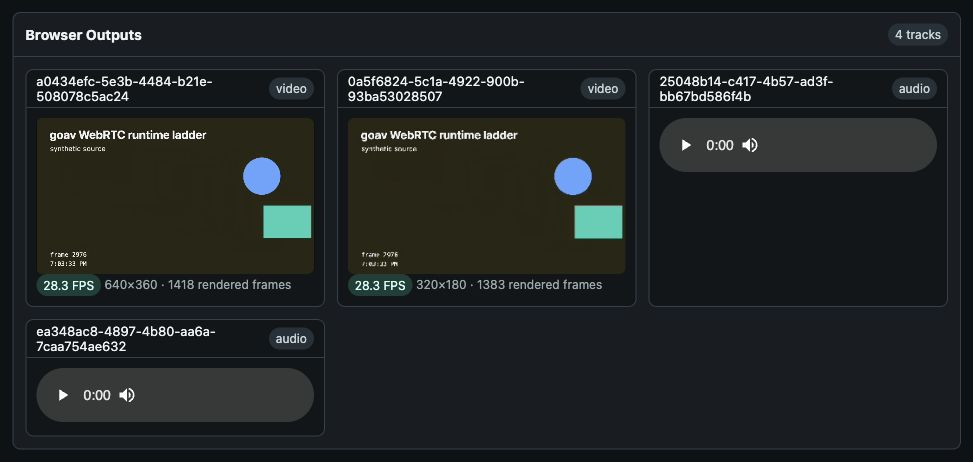

# Gio WebRTC showcase

This standalone module is a native Gio control room for live `goav` WebRTC
media. A small browser peer handles camera/microphone permissions and playback;
the Gio window controls the live `goav` graph, runtime branches, diagnostics,
planner scenarios, and audio meters.

Use this demo when you want to see the live-room runtime from both sides: a
browser peer with real media tracks, and a native app controlling sync,
branches, rebranching, bitrate, pause/resume, and diagnostics.



Run:

```sh
go run .
```

The Gio window shows the browser peer URL. Click **Open Peer**, start camera or
synthetic A/V in the browser, then add, pause, resume, retune, rebranch, or
remove output branches from Gio. The browser automatically renegotiates when
Gio adds or removes WebRTC output tracks.

The native Gio control room is compiled when cgo is available. Server-only mode
is useful for browser/API testing and is also the fallback for pure-Go builds:

```sh
go run . -headless
CGO_ENABLED=0 go run .
```

Optional native speaker preview uses Oto and is compiled only with a build tag:

```sh
go run -tags nativeaudio .
```

Browser playback remains the default because Oto depends on platform audio
drivers on some targets.

What it demonstrates:

- Gio desktop UI over a live media runtime.
- WebRTC VP8 video ingest and VP8 output branches (VP8-only so the goav data
  plane is isolated from VP9 encoder behavior; the runtime still supports VP9).
- Pure-Go Opus decode/encode through `github.com/thesyncim/gopus`.
- Audio resample, mono/stereo branch fanout, level meters, waveform, packet
  counters, packet-loss/PLC counters, and live Opus bitrate retargeting.
- Runtime branch attach, detach, pause, resume, and rebranch without rebuilding
  the task.
- Planner scenarios for Opus ladder, Mix with auto-resample, and structured
  invalid-shape errors.

Tests:

```sh
go test ./...
go test -tags nativeaudio ./...
```
